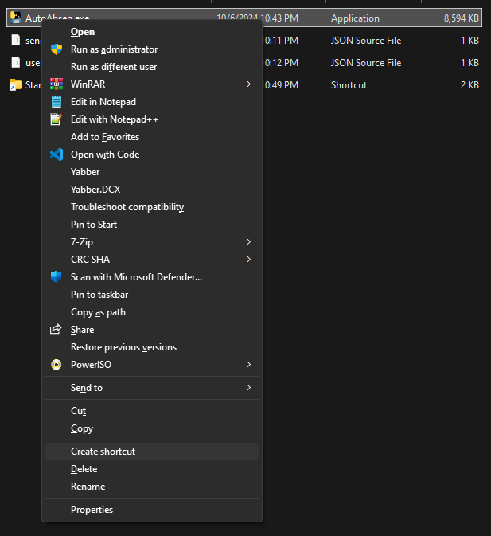
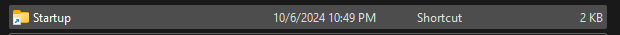

# Auto Absen untuk SMK Negeri 2 Surakarta

Aplikasi ini dibuat untuk melakukan absen otomatis pada pembelajaran online di SMK Negeri 2 Surakarta. Pengguna hanya perlu menghidupkan laptop dan membuka Telegram untuk menjalankan bot ini.

## Penggunaan

1. **Dapatkan Chat ID**  
   Pertama-tama, dapatkan `chat_id` dari bot berikut: [RawDataBot](https://t.me/RawDataBot). Setelah memulai pesan, Anda akan menerima data seperti berikut:

   ```json
   {
     ...
     "message": {
       ...
       "chat": {
         "id": YOUR_ID,
         "first_name": "first_name",
         "username": "username",
         "type": "private"
       },
       ...
     }
   }
   ```

2. Isi Kredensial Pengguna
   Selanjutnya, isi `username`, `password`, dan `chat_id` Telegram pada file `user_credentials.json`:

```json
{
  "username": "EMAIL",
  "password": "PASSWORD",
  "chat_id": "ID_CHAT_TELEGRAM"
}
```

3. Buat Shortcut
   Buatlah shortcut dari `AutoAbsen.exe`, kemudian pindahkan shortcut yang telah dibuat ke dalam folder Startup.




